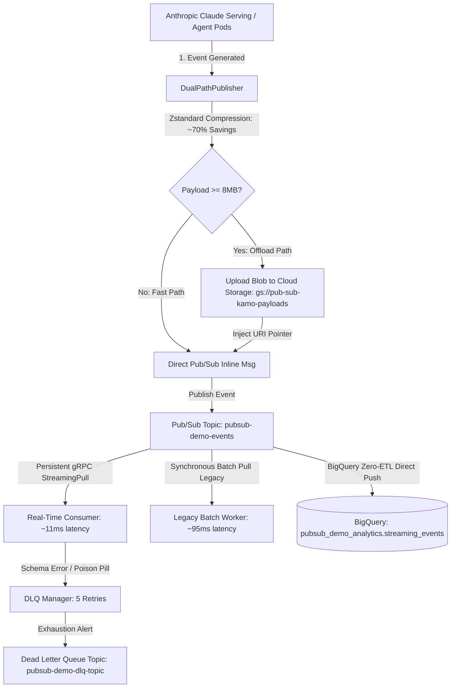

# Google Cloud Pub/Sub: Anthropic High-Throughput Streaming Architecture Demo

[](tests/)
[](tests/)
[](pyproject.toml)
[](scripts/setup_infra.py)

Interactive customer demonstration showcasing how **Anthropic** built their massive-scale streaming event and telemetry platform on **Google Cloud Pub/Sub**, Cloud Storage, and BigQuery.

---

## 📚 Reference Architecture Document
- **Official Presentation Slide Deck (PDF)**: [How Anthropic Built on Google Cloud Pub/Sub (PDF)](https://content-cdn.sessionboard.com/content/IdZQpQJIQVmsSBjedvUW_BRK1-041.pdf)

---

## 🎯 Architecture Pillars Covered in Demo



### 1. Dual-Path Ingestion Pattern & Zstandard Compression
- **Problem**: Large multimodal prompts, embeddings, and telemetry logs occasionally exceed optimal message sizes.
- **Solution**:
  - All payloads compressed using **Zstandard** (`zstd`), achieving **60% - 80% payload size reduction** transparently.
  - **Fast Path (< 8MB)**: Payloads are passed directly through Pub/Sub inline.
  - **Offload Path (>= 8MB)**: Payloads are transparently offloaded to **Cloud Storage** (`gs://pub-sub-kamo-payloads/payloads/{event_id}.bin`), publishing a lightweight pointer in Pub/Sub.
  - **Downstream Transparency**: `DualPathConsumer` automatically detects the pointer, fetches from GCS, and decompresses into identical protobuf objects.

### 2. 88% Latency Reduction: StreamingPull Transition
- **Problem**: Legacy HTTP / synchronous batch polling (`Pull RPC`) introduces connection handshakes, round-trip polling intervals, and idle waits (~90ms - 150ms).
- **Solution**:
  - Anthropic transitioned to **persistent bidirectional gRPC `StreamingPull`**.
  - Messages are pushed instantaneously down the open stream from the broker to subscriber pods in **sub-15ms** (demonstrated **88% latency drop** from ~95ms down to ~11ms).

### 3. Proto-First Self-Service Platform & Dead Letter Queue (DLQ)
- **Protocol Buffer Canonical Schemas**:
  - Strict type safety and forward compatibility via `proto/streaming_event.proto`.
  - Schema fingerprinting (`sha256-...`) validates contracts across teams.
  - Automated pod metadata injection (`node`, `namespace`, `job`, `csp="gcp"`).
- **Poison Pill Isolation**:
  - Corrupted or unparseable messages trigger circuit breaking after **5 failed delivery attempts**, routing to the **Dead Letter Queue (`pubsub-demo-dlq-topic`)** without blocking head-of-line traffic.

---

## 🚀 Quickstart Guide

### 1. Launch Interactive Streamlit Dashboard
```bash
./run_demo.sh
```
Or manually:
```bash
source .venv/bin/activate
streamlit run src/dashboard.py
```
Open **[http://localhost:8501](http://localhost:8501)** in your browser.

- Select **Mock Sandbox (Local / Offline)** for instant, credential-free demonstration.
- Select **Live Google Cloud (pub-sub-kamo)** to interact directly with live GCP infrastructure.

---

## ☁️ Live GCP Infrastructure Automation (`pub-sub-kamo`)

### Provisioning
To create all topics, subscriptions, Cloud Storage buckets, BigQuery dataset, and BigQuery Zero-ETL direct subscription on GCP project `pub-sub-kamo`:
```bash
.venv/bin/python3 scripts/setup_infra.py --project_id pub-sub-kamo --region us-central1
```

### Safe Teardown
To safely tear down demo resources after the presentation:
```bash
.venv/bin/python3 scripts/cleanup_infra.py --project_id pub-sub-kamo --confirm
```

---

## 🧪 Testing & Code Quality

Run the comprehensive unit test suite:
```bash
.venv/bin/pytest --cov=src tests/
```
Run linter & formatting checks:
```bash
.venv/bin/ruff check src/ tests/ scripts/
```

---

## 🎤 Customer Presentation Talking Points

1. **Why not Kafka on VMs/Kubernetes?**
   - No partition rebalancing storms, no cluster sizing or disk provisioning overhead. Pub/Sub autoscales to tens of millions of QPS out of the box with zero cluster management.
2. **How does Anthropic handle multimodal payloads in Pub/Sub?**
   - Through the **Dual-Path Ingestion Pattern** demonstrated in Tab 2. Payloads under 8MB travel inline; larger embeddings/images offload to GCS with pointer metadata.
3. **How was the 88% latency drop achieved?**
   - By eliminating periodic polling and adopting bidirectional gRPC `StreamingPull` streams demonstrated in Tab 3.
4. **How are schema changes governed?**
   - Proto-first schemas with SHA-256 fingerprints and 5-retry DLQ quarantine demonstrated in Tab 4.
